# YARFF (Yet Another Robot For Fun)

One more robot project for workshops aimed at people willing to learn about programming (and a little bit about arduino).

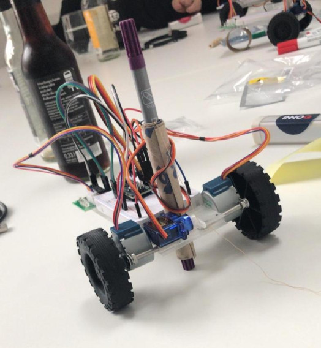

This repository aims to be a step by step guide for a workshop in which participants build a robot that draws what they tell it to. Originally this workshop was meant for kids 11 through 15, but anyone is welcome to enjoy some tinkering and an introduction to programming.

We felt like commercial solutions, although of high quality, were not accessible for everyone (due to their price tag). Besides the lower cost, the upside of this project is the additional "sense of pride and accomplishment" that a participant will experience after seeing how something they built themselves comes to life.

## Contributing

Please feel free open an issue or pull request if you would have to improve this document! All the materials on this repository are provided under the [Attribution-NonCommercial 4.0 International (CC BY-NC 4.0) ](https://creativecommons.org/licenses/by-nc/4.0/) license.

# Building blocks

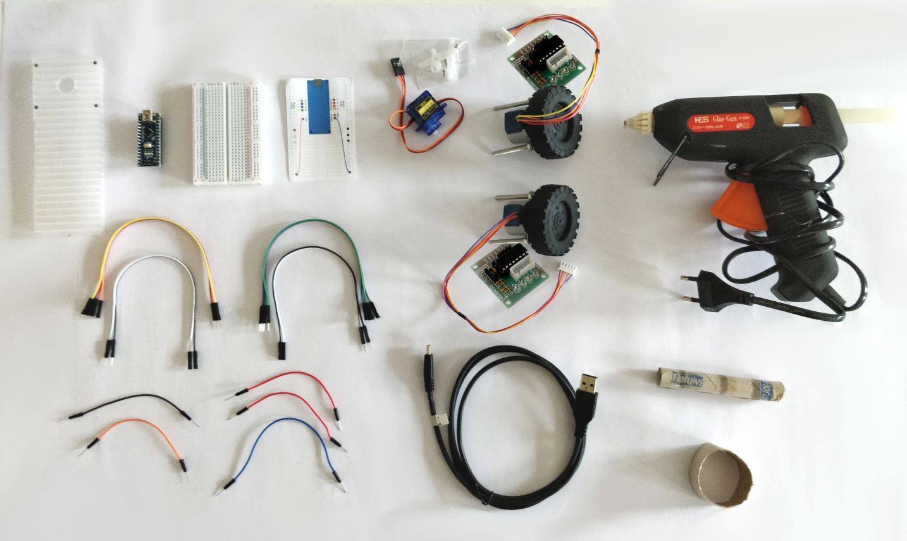

- 1x 14,5cm x 5,2cm support plate (see [`support-plate.svg`](./images/support-plate.svg))
- 1x Arduino nano
- 1x Breadboard
- 1x Breadboard template (see [`breadboard-template.svg`](./images/breadboard-template.svg))
- 1x Servo motor
- 2x Step motor
- 2x Step motor controller
- 4x Screws (5cm)
- 2x 25mm ⌀ Rubber wheel (e.g. [this one](https://www.pollin.de/p/rad-aus-weich-pvc-820437))

- 2x Red male to male jumper cable
- 1x Orange male to male jumper cable
- 1x Black male to male jumper cable
- 1x Blue male to male jumper cable
- 1x Gray male to female jumper cable
- 1x Purple male to female jumper cable
- 1x Blue male to female jumper cable
- 1x Green male to female jumper cable
- 1x Brown male to female jumper cable
- 1x Red male to female jumper cable
- 1x Orange male to female jumper cable
- 1x Yellow male to female jumper cable
- 2x White male to female jumper cable
- 2x Black male to female jumper cable

- 1x USB cable (USB-A male to USB-mini male)

- 1x Coloured brush pen
- 1x Sawing thread, about 2,5 times the length of the pen
- 1x Toilet paper core rolled together with an outer diameter of approx 1,5 cm and an inner diameter of the pen you want to use
- 1x Toilet paper core cut to approximatelly 2cm width
- 1x Hot glue gun

## Cost

The table below shows the cost of a single robot (about 20€ - glue gun and common household materials not taken into consideration), based on prices of regular to small packs of the components needed, as sold by common online retailers.

|                                    | Pack of | Cost (€)  | Cost / unit | Units / robot | Cost / robot |
|-----------------------------------:|--------:|----------:|------------:|--------------:|-------------:|
| **Arduino nano compatible chip**   | 5       | 16.99     | 3.40        | 1             | 3.40         |
| **Breadboard**                     | 3       | 6.99      | 2.33        | 1             | 2.33         |
| **Servo motor**                    | 3       | 8.99      | 3.00        | 1             | 3.00         |
| **Step motor with controller**     | 5       | 14.55     | 2.91        | 2             | 5.82         |
| **Rubber wheel**                   | 1       | 0.60      | 0.60        | 2             | 1.20         |
| **Jumper cables (male to male)**   | 40      | 3.49      | 0.09        | 5             | 0.44         |
| **Jumper cables (male to female)** | 195     | 6.99      | 0.04        | 12            | 0.43         |
| **Total**                          |         |           |             |               | **16.61**    |


# Assembly

This process takes about an hour. **Please read all the steps before starting!**

1. Place breadboard template on breadboard, aligning the end opposite to the arduino board to the edge of the breadboard.
2. Insert arduino board carefully following template. Ensure that D-Pins (five through seven) align with the print on the template. Set breadboard aside.

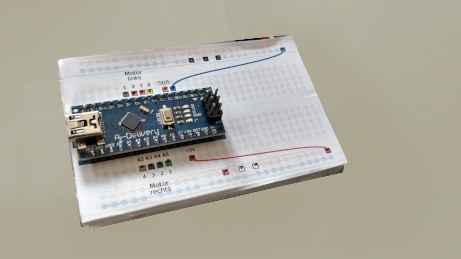

3. Insert screws through stepper motor. Ensure that head of screw is on the same side as the axis for the wheel.
4. Depending on the kind of supporting board that you are using, assemble wheel with motor and then insert the motor with the wheel into the supporting board **or** insert/screw motor into supporting board and then attack motor to rubber wheel. The screws should be aligned with the markings shown in `support plate.svg` and the cables should be facing upward.
5. Repeat with other wheel.
6. Insert rolled-up toilet paper core through hole in the supporting board. Ensure that the toilet paper core is six or seven milimeters above the ground. Fasten the toilet paper core with the glue gun

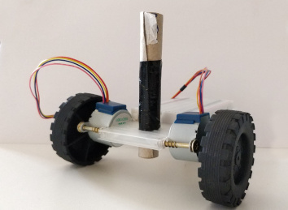

7. Remove yellow cover underneath the breadboard, revealing an adhesive surface. With the arduino chip facing away from the toilet paper role, fasten the breadboard on top of the supporting board.


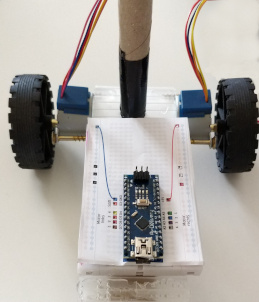

8. With the help of the glue gun fix the 2cm paper roll core to the back of the supporting board. Squeeze the toilet paper roll in such a way that the supporting board is parallel to the ground.

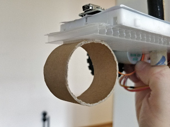

9. Again with the help of the glue gun paste the controllers of each wheel on the very back of the supporting board.

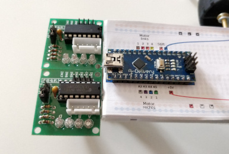

10. Use the glue gun one more time to fix the servo motor to the front of the support board. Make sure that the motor's axis is more or less on the center of the support board.

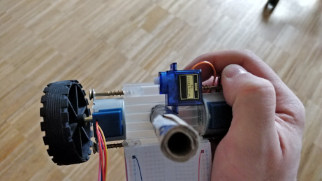

## Wiring the step motors

11. Pick up the **blue** male to male jumper cable and one of the **red** ones. Look for the boxes in the template connected by a line and insert the cables according to their colours.

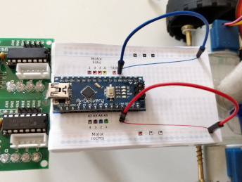

12. Connect the left motor with the left controller.

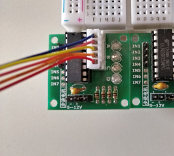

13. Take the **brown**, **red**, **orange** and **yellow** female to male cables and insert them following the "Left motor" markings on the template.

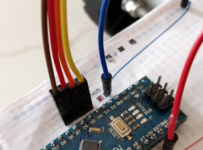

14. Connect the brown cable with the `IN1` pin on the left wheel's controller. Do the same thing with the rest of the cables and their assigned `IN` pins.
15. With the help of one of the **white** female to male cables, connect the `+12V` pin of the left controller with one of the **white** squares on the template.
16. With the help of one of the **black** female to male cables, connect the `-5V` pin of the left controller with one of the **black** squares on the template.

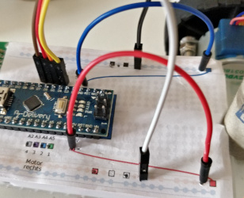 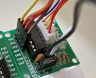

17. Repeat the process with the right motor, with the corresponding colours on the template.

## Wiring the servo motor

18. Connect one end of the **orange** male to male jumper cable to the **orange** cable of the servo motor.
19. Insert the other end to the **orange** square on the template (next to the left motor cables).
20. Connect one end of the **red** male to male jumper cable to the **red** cable of the servo motor.
21. Insert the other end to the **red** square on the template (next to the white cables).
22. Connect the **black** male to male jumper cable to the **brown** cable of the servo motor.
23. Insert the other end to the **black** square on the template (next to the other black cables).

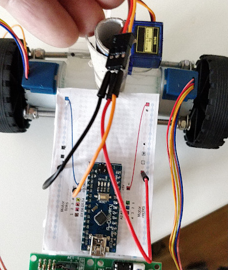

## Tying the pen to the servo motor

_TODO: This section needs to be improved and carefully worded_

24. Insert the "one sided proppeler" into the servo's axis
25. Tie one end of the sawing thread around the tip of the pencil
26. Tie the other end of the sawing thread to the "one sided proppeler"

# Programming

## Using Snap4Arduino to program the virtual robot

_TODO_

- Base project and building blocks
- Notes for mentors

## Connecting Snap4Arduino to the real robot

_TODO_

- Building blocks related to the connection to the nano board
- Notes for mentors

## Uploading code to the robot for operation without Snap4Arduino

_TODO_

- Generating code
- Uploading code to the robot via Arduino IDE
- Notes for mentors

## Additional blocks

_TODO_

- Alphabet "library"

## Possible activities

- Programm the robot to write your name
- Programm the robot to draw a spiral
- Programm the robot to draw a star
- Programm the robot two draw an envelope with the flap open... without lifting the pen from the paper, crossing any of the lines already drawn or tracing over another line
- Programm the robot to trace an isometric ("3D") cube
  ```
     ___________
    /          /|
   /__________/ |
  |          |  |
  |          |  |
  |          |  |
  |          | /
  |__________|/
  ```
