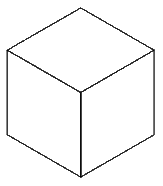

# YARFF (Yet Another Robot For Fun)

One more robot project for workshops aimed at people willing to learn about programming (and a little bit about arduino).


This repository aims to be a step by step guide for a workshop in which participants build a robot that traces what they tell it to. The robot can move forwards and backwards, turn around lift it's pen up or set it down.

Originally this workshop was meant for kids 11 through 15, but anyone is welcome to enjoy some tinkering and an introduction to programming.

We felt like commercial solutions, although of high quality, were not accessible for everyone (due to their price tag). Besides the lower cost, the upside of this project is the additional "sense of pride and accomplishment" that a participant will experience after seeing how something they built themselves comes to life.

## Contributing

Please feel free open an issue or pull request if you would have to improve this document! All the materials on this repository are provided under the [Attribution-NonCommercial 4.0 International (CC BY-NC 4.0) ](https://creativecommons.org/licenses/by-nc/4.0/) license.

# Building blocks


## Core components

- 1x 14,5cm x 5,2cm support plate (see [`support-plate.svg`](./images/support-plate.svg))
- 1x Arduino nano
- 1x Breadboard
- 1x Breadboard template (see [`breadboard-template.svg`](./images/breadboard-template.svg))
- 1x Servo motor
- 2x Step motor
- 2x Step motor controller
- 4x Screws (5cm)
- 2x 25mm ⌀ Rubber wheel (e.g. [this one](https://www.pollin.de/p/rad-aus-weich-pvc-820437))

## Cables

- 2x Red plug-plug jumper cable
- 1x Orange plug-plug jumper cable
- 1x Black plug-plug jumper cable
- 1x Blue plug-plug jumper cable
- 1x Gray plug-socket jumper cable
- 1x Purple plug-socket jumper cable
- 1x Blue plug-socket jumper cable
- 1x Green plug-socket jumper cable
- 1x Brown plug-socket jumper cable
- 1x Red plug-socket jumper cable
- 1x Orange plug-socket jumper cable
- 1x Yellow plug-socket jumper cable
- 2x White plug-socket jumper cable
- 2x Black plug-socket jumper cable
- 1x USB cable (USB-A male to USB-mini male)

## Common household items / tools

- 1x Coloured brush pen
- 1x Sawing thread, about 2,5 times the length of the pen
- 1x Toilet paper core rolled together with an outer diameter of approx 1,5 cm and an inner diameter of the pen you want to use
- 1x Toilet paper core cut to approximatelly 2cm width
- Scissors
- 1x Hot glue gun

## Cost

The table below shows the cost of a single robot (about 20€ - glue gun and common household materials not taken into consideration), based on prices of regular to small packs of the components needed, as sold by common online retailers.

|                                    | Pack of | Cost (€)  | Cost / unit | Units / robot | Cost / robot |
|-----------------------------------:|--------:|----------:|------------:|--------------:|-------------:|
| **Arduino nano compatible chip**   | 5       | 16.99     | 3.40        | 1             | 3.40         |
| **Breadboard**                     | 3       | 6.99      | 2.33        | 1             | 2.33         |
| **Servo motor**                    | 3       | 8.99      | 3.00        | 1             | 3.00         |
| **Step motor with controller**     | 5       | 14.55     | 2.91        | 2             | 5.82         |
| **Rubber wheel**                   | 1       | 0.60      | 0.60        | 2             | 1.20         |
| **Jumper cables (plug-plug)**      | 40      | 3.49      | 0.09        | 5             | 0.44         |
| **Jumper cables (plug-socket)**    | 195     | 6.99      | 0.04        | 12            | 0.43         |
| **Total**                          |         |           |             |               | **16.61**    |


# How the workshop unflods

The workshop is meant to take five to six hours, and is divided in two main parts: *assembling* the robot (about an hour), and *programming* the robot (which could very well take up the rest of the time allotted for the workshop).

Depending on the size of the group, participants may assemble their respective robots and then work on the programming in pairs. Assembling is pretty mechanical, but discussing how to tell the robot what to do is more fun in pairs.

# Assembly

This process takes about an hour. Some preparation in advance can help reduce overhead (e.g. looking for the right cable). It is at the discretion of the mentor(s) how much to get done in advance.

(You will notice that the assembly relies heavily on color codes. Contributions for a colorbind-friendly version are very welcome)

**Please read all the steps before starting!**

1. Place breadboard template on breadboard, aligning the end opposite to the arduino board to the edge of the breadboard.
2. Insert arduino board carefully following template. Ensure that D-Pins (five through seven) align with the print on the template. Set breadboard aside.

    

3. Insert screws through stepper motor. Ensure that head of screw is on the same side as the axis for the wheel.

    

4. Depending on the kind of supporting board that you are using, assemble wheel with motor and then insert the motor with the wheel into the supporting board **or** insert/screw motor into supporting board and then attach motor to rubber wheel. The screws should be aligned with the markings shown in `support plate.svg` and the cables should be facing upward.

5. Repeat with other wheel.
6. Insert rolled-up toilet paper core through hole in the supporting board. Ensure that the toilet paper core is six or seven milimeters above the ground. Fasten the toilet paper core to the supporting board with the glue gun

    

7. Remove yellow cover underneath the breadboard, revealing an adhesive surface. With the arduino chip facing away from the toilet paper role, fasten the breadboard on top of the supporting board.

    

8. With the help of the glue gun fix the 2cm paper roll core to the back of the supporting board. Squeeze the toilet paper roll in such a way that the supporting board is parallel to the ground.

    

9. Again with the help of the glue gun paste the controllers of each wheel on the very back of the supporting board. **Be careful:** the `IN1`, `IN2`, etc pins of the controllers should **not be** right before the arduino board's usb connector. Otherwise we will have trouble connecting the cable later.

    

10. Use the glue gun one more time to fix the servo motor to the front of the support board. Make sure that the motor's axis is more or less on the center of the support board.

    

## Wiring the step motors

11. Pick up the **blue** plug-plug jumper cable and one of the **red** ones. Look for the boxes in the template connected by a line and insert the cables according to their colours.

    

12. Connect the left motor with the left controller.

    

13. Take the **brown**, **red**, **orange** and **yellow** plug-socket cables and insert them following the "Left motor" markings on the template.

    

14. Connect the brown cable with the `IN1` pin on the left wheel's controller. Do the same thing with the rest of the cables and their assigned `IN` pins.
15. With the help of one of the **white** plug-socket cables, connect the `+12V` pin of the left controller with one of the **white** squares on the template.
16. With the help of one of the **black** plug-socket cables, connect the `-5V` pin of the left controller with one of the **black** squares on the template.

     

17. Repeat the process with the right motor, with the corresponding colours on the template.

## Wiring the servo motor

18. Connect one end of the **orange** plug-plug jumper cable to the **orange** cable of the servo motor.
19. Insert the other end to the **orange** square on the template (next to the left motor cables).
20. Connect one end of the **red** plug-plug jumper cable to the **red** cable of the servo motor.
21. Insert the other end to the **red** square on the template (next to the white cables).
22. Connect the **black** plug-plug jumper cable to the **brown** cable of the servo motor.
23. Insert the other end to the **black** square on the template (next to the other black cables).

    

## Tying the pen to the servo motor

```
⚠ TODO: This section needs to be improved and carefully worded
```

24. Insert the "one sided proppeler" into the servo's axis
25. Tie one end of the sawing thread around the tip of the pencil
26. Tie the other end of the sawing thread to the "one sided proppeler"

# Programming

A nice exercise to do after building the robot and before programming is to play "dumb robot".

## The "dumb robot" exercise

The mentor can explain that programming is basically telling the computer (or in our case the robot) exactly what it has to do, step by step. In our case, the robot only understands the following commands:

- Set pen down
- Lift pen up
- Move formard so many steps
- Move backwards so many steps
- Turn right so many degrees
- Turn left so many degrees

The mentor can now introduce themselves as a "dumb robot" and stand next to a whiteboard (or flip chart or similar) and hover a pen above the surface.

The group should now work together and describe, by using the commands above, the steps needed to write the "robot's" initials on the board. Ask one participant to write down the steps at the other end of the board.

At the end of the exercise the mentor may again emphasize the similarities of the process that just took place (the group reasoning what to do, discussing what the robot should do, maybe someone provided already "optimized" paths, etc.) with the every day tasks of a software developer.

After this exercise you can move to working at the computer.

## Using Snap4Arduino to program the virtual robot

Before we connect the robot to the computer we will practice programming a virtual version of the robot. The feedback loop is quicker as compared to letting the robot trace on the paper.

### Initial set up

1. Download and install [snap4arduino](http://snap4arduino.rocks/).

### Base project and snap blocks

Open snap4arduino and select the menu button with a sheet of paper on it.


After that click on `Import` and select the file `1 - standard project.xml`. This (among other things) will import some blocks that we can use to interact with the "virtual" robot (usually shown on the upper right quarter of the screen, on white background). The new blocks can be found in the block list, after you select the `Arduino` block category on the upper left of your screen.

In the following steps we will practice with the virtual robot before connecting to the real one.

#### Robot configuration block

```
⚠ TODO Add screenshots
```

If you scroll through the list of available blocks, you will find the `Configure robot` block.
This block contains some basic properties of the robot, for instance how fast does it move and turn, or how long is a "step" in any direction.

We will always need to use this block in order to interact with the robot, so go ahead and drag and drop this block into the main area.

#### Movement  blocks

Further blocks that you will find under the `Arduino` block category are:

- `move __ steps forwards`
- `move __ steps backwards`
- `turn __ degrees left`
- `turn __ degrees right`
- `lift pen up`
- `set pen down`

You can drag and drop blocks to the bottom of the `Configure robot` block. You can press on `Configure robot` and the virtual robot will do whatever you tell it to.

Play around with these blocks: try moving around, lifting up the pen and setting it down, and so on.

In the `Pen` blocks category you can find a `clear` block. You can click this block to clean up the lines drawn by the robot.

### Notes for mentors

```
⚠ TODO
```

## Connecting Snap4Arduino to the real robot

First we need to ensure that the arduino chip is prepared to receive commands from snap4arduino. **We will only need to run this once**.

To achieve this, we will download, install and open the [arduino IDE](https://www.arduino.cc/en/Main/Software#download).

1. connect the robot to the computer with the USB cable
2. ensure that `Arduino nano` is selected under `Tools > Board`
3. depending on the board bought, `Tools > Board` will have to have the value `ATmega328P` or `ATmega328P (Old Bootloader)`. If you have problems when uploading the firmware try changing this value

  

4. Under `Tools > Port` select the one that says `/dev/ttyXXXXX` (under MacOs or Linux) or try your luck with different `COMX` ports under Windows
5. Select `File > Examples > Firmata > StandardFirmata`. This will open a new Window

  

6. Press the upload button (the right facing arrow on the toolbar  )

7. Once the window says `Done uploading` you can close the Arduino IDE

  

## Snap blocks related to the arduino board

```
⚠ TODO
```

- Configuring the wheel motors
- Configuring the pen's servo

### Notes for mentors

```
⚠ TODO
```

## Uploading code to the robot for operation without Snap4Arduino

```
⚠ TODO
```

### Generating code

```
⚠ TODO
```

- "Generate code" block
- Save code

### Uploading code to the robot via Arduino IDE

```
⚠ TODO
```

- Open code with arduino ide
- Upload code


### Notes for mentors

```
⚠ TODO
```

## Additional blocks

```
⚠ TODO
```

- Alphabet "library"

## Possible activities

- Program the robot to write your name
- Program the robot to draw a spiral
- Program the robot to draw a star
- Program the robot two draw an envelope with the flap open... without lifting the pen from the paper, crossing any of the lines already drawn or tracing over another line

    

- Program the robot to trace an isometric cube

    
